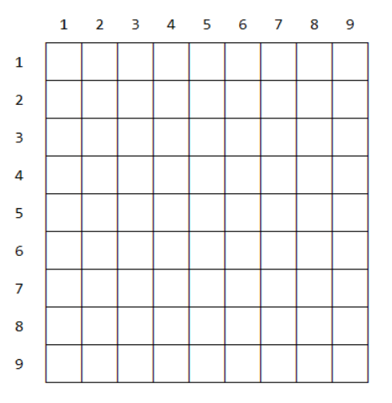
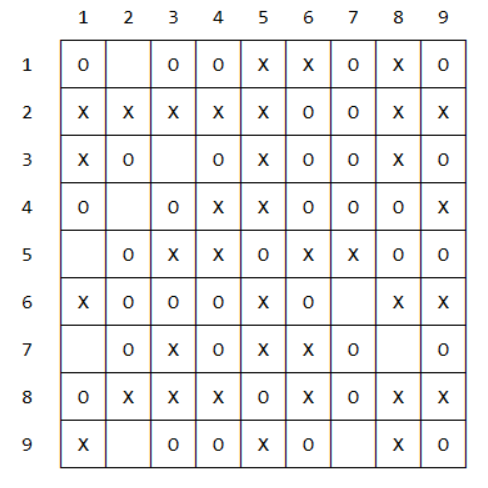

# Relatório Intermédio - PLOG

#### Jogo: Taiji
**Grupo**: Taiji_3
**Turma**: 6
**Professor**: Daniel Castro Silva
**Elementos**:
    - Diogo Samuel Gonçalves Fernandes (up201806250)
    - Paulo Jorge Salgado Marinho Ribeiro (up201806505)

---
## Descrição do jogo - Taiji

```Meter estar descição??
TAIJI is a Chinese term that means ‘Great Duality’ and represents the fight of Good vs. Evil, Light vs. Darkness, YIN vs. YANG.

But YIN and YANG are indivisible! That’s why both players use the same indivisible “dual” pieces called TAIJITUS.
```

Taiji é um jogo de tabuleiro. Este pode ter três dimensões diferentes, sendo elas 7x7, 9x9 ou 11x11.

O objetivo é obter o maior conjunto de quadrados conectados da sua cor, colocando *Taijitus* no tabuleiro.

*Taijitus* são as peças do jogo. Estas contém ambas as cores, o preto e o branco.
Deste modo, cada vez que um *Taijitu* é jogado, você está jogando com as duas cores, pelo que é possível estar a ajudar o jogo do seu oponente!

O jogador branco começa e estes alternam de turno durante o jogo.

Sempre que for a sua vez de jogar, o jogador deve colocar um *Taijitu* no tabuleiro, desde que haja espaço livre para fazê-lo. Um *Taijitu* só pode ser colocado em um espaço livre de 2 quadrados conectados. Um quadrado é considerado conectado a outro quadrado se for horizontal ou verticalmente adjacente (não diagonalmente).

O jogo termina quando não há espaço livre para colocar *Taijitus*. O jogador com a pontuação mais alta ganha o jogo. Para obter sua pontuação, some o tamanho dos 'n' maiores grupos de sua cor, com 'n' sendo o tipo de pontuação determinado na fase de configuração. Para determinar o tamanho de um grupo, basta contar os quadrados que o correspondem. Em caso de empate, o jogador “Dark” vence.

> Taiji Rules: https://nestorgames.com/rulebooks/TAIJI_EN4.pdf

--- 
## Representação interna do jogo

Representação do tabuleiro (lista de listas com diferentes átomos para as peças)

Jogador atual

Peças capturadas ou por jogar

Outras informação

Código em prolog dos estados de jogo inicial, intermédio e final.

---
## Visualização do estado do jogo

Descrição da implementação do predicado de visualização do estado de jogo.






Representação dos três diferentes estados de jogo num tabuleiro 9x9