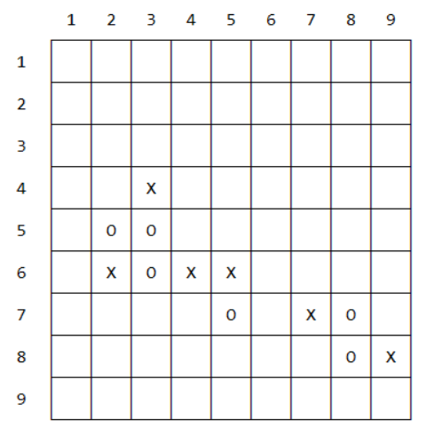

# Relatório Intermédio - PLOG

#### Jogo: Taiji
**Grupo**: Taiji_3
**Turma**: 6
**Professor**: Daniel Castro Silva
**Elementos**:
    - Diogo Samuel Gonçalves Fernandes (up201806250)
    - Paulo Jorge Salgado Marinho Ribeiro (up201806505)

---
## Descrição do jogo - Taiji

Taiji é um jogo de tabuleiro, cujo nome significa "Grande Dualidade" e representa a luta do Bem vs Mal, Luz vs Escuridão, YIN vs YANG. Este pode ter três dimensões diferentes, sendo elas 7x7, 9x9 ou 11x11.

O objetivo é obter o maior conjunto de quadrados conectados da cor do jogador em questão, colocando *Taijitus* no tabuleiro.

*Taijitus* são as peças do jogo. Cada peça contém uma parte preta e uma parte branca.  Isto acontece porque o Bem e o Mal são indivisíveis! Daí ambos os jogadores usarem as mesmas peças "duplas" indivisíveis.
Deste modo, cada vez que um *Taijitu* é jogado, são colocadas em tabuleiro ambas as cores, pelo que é possível estar a ajudar o jogo do seu oponente!

O jogador branco inicia o jogo e estes alternam de turno durante o jogo, a cada peça jogada.

Sempre que for a sua vez de jogar, o jogador deve colocar um *Taijitu* no tabuleiro, desde que haja espaço livre para fazê-lo. Um *Taijitu* só pode ser colocado em um espaço livre de 2 quadrados conectados. Um quadrado é considerado conectado a outro quadrado se for horizontal ou verticalmente adjacente (não diagonalmente).

O jogo termina quando não há espaço livre para colocar *Taijitus*. O jogador com a pontuação mais alta ganha o jogo. Para obter a sua pontuação, some o tamanho dos 'n' maiores grupos de sua cor, sendo 'n' o tipo de pontuação determinado na fase de configuração. Para determinar o tamanho de um grupo, basta contar os quadrados da mesma cor que o compõem. Em caso de empate, o jogador “Dark” vence.

> Regras Oficiais do jogo: https://nestorgames.com/rulebooks/TAIJI_EN4.pdf

--- 
## Representação interna do jogo

O tabuleiro é representado como uma matriz de N colunas por N linhas, pelo que vamos representá-lo como uma lista de listas, sendo cada sublista uma linha do tabuleiro. A matriz inicial é obtida de forma dinâmica, da seguinte forma:

```prolog
% initial(N, M) -> creates the initial matrix M for the board, with dimensions N x N
initial(N, M) :- init_board(N, N, [], M).

init_board(0, _, M, M).
init_board(N, NC, MI, M) :-
    N > 0,
    N1 is N - 1,
    create_line(NC, [], L),
    init_board(N1, NC , [L|MI], M).

create_line(0, M, M).
create_line(N, MI, M) :-
    N > 0,
    N1 is N - 1,
    create_line(N1, [empty|MI], M).
```

Cada peça, denominada de *Taijitu* possui uma parte branca e preta, ocupando por isso duas casas do tabuleiro, uma para cada parte. Futuramente, cada peça vai ter o número da linha e coluna da parte branca da peça e a orientação (cima, direita, baixo, esquerda) de modo a conhecer a localização da parte preta. Identificamos as casas vazias com o caracter ' ' (espaço), as casas brancas com o caracter 'W' e as casas pretas com o caracter 'B'.

```prolog
% character(Name, Symbol) -> returns the Symbol for the cell with name Name
character(empty, ' ').
character(black, 'B').    
character(white, 'W').
```

#### Diferentes estados de jogo

O estado inicial de jogo vai ser uma matriz contendo apenas o valor empty, construída dinamicamente como foi referido acima.

Uma possível representação de um estado de jogo intermédio, com algumas peças colocadas, mas espaços livres para colocar novas peças, pode ser o seguinte:
```prolog
intermediateBoard([
    [black, white, empty, empty, empty, empty, empty, empty, empty],
    [black, white, black, empty, empty, empty, empty, empty, empty],
    [white, empty, empty, empty, empty, empty, empty, empty, empty],
    [empty, empty, empty, empty, empty, white, black, empty, empty],
    [empty, empty, empty, empty, empty, empty, empty, empty, empty],
    [empty, empty, empty, empty, black, empty, empty, empty, empty],
    [empty, empty, empty, empty, white, white, black, empty, empty],
    [empty, empty, empty, empty, empty, empty, empty, empty, empty],
    [empty, empty, empty, empty, empty, empty, empty, empty, empty]
]).
```
E uma representação final, em que já não é possível colocar mais nenhuma peça no tabuleiro, pode ser da seguinte forma:

```prolog
finalBoard([
    [black, white, empty, white, black, empty, black, white, empty],
    [black, white, black, white, empty, white, black, black, white],
    [white, white, black, black, black, white, empty, white, white],
    [white, black, white, black, white, white, black, black, black],
    [black, black, white, white, empty, white, white, black, empty],
    [empty, black, white, black, black, black, empty, white, white],
    [white, white, white, black, white, white, black, black, black],
    [black, black, black, white, white, black, white, black, empty],
    [empty, white, black, black, white, black, white, white, black]
]).
```

---
## Visualização do estado do jogo

As funções que estão responsáveis pela visualização encontram-se no ficheiro [display.pl](display.pl).

O predicado play chama o predicado *display_game(Gamestate, Player)*, que por sua vez chama *display_board(Gamestate)* seguido de *display_turn(Player)*. Desta forma, é apresentado o tabuleiro no estado recebido, e é indicado o jogador que deve jogar no turno. Posteriormente, serão adicionados aqui novos predicados, de maneira a receber e tratar os inputs dos jogadores.

O predicado **display_board** efetua a visualização do tabuleiro, tanto das suas casas como da grelha númerica que permite aos utilizadores identificarem cada casa. A função *print_numbers* é utilizada para a enumeração de 1 até N das linhas de jogo, *print_limits* é utilizada para a criação dos limites superior e inferior (usando o caracter '_') e *print_matrix* para a visualização da matriz de jogo.
```prolog
display_board(Gamestate, N) :-
    nl, write('     '), print_numbers(1, N), nl,
    write('   _'), print_limits(N * 4), nl, nl,
    print_matrix(Gamestate, 1, N),
    write('   _'), print_limits(N * 4),  nl, nl.
```

### Exemplos
Apresentam-se agora exemplos da visualização de três estados de jogo diferentes, num tabuleiro 9x9:




